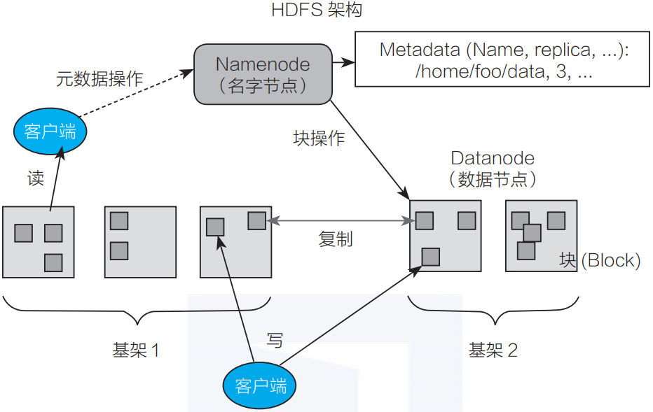
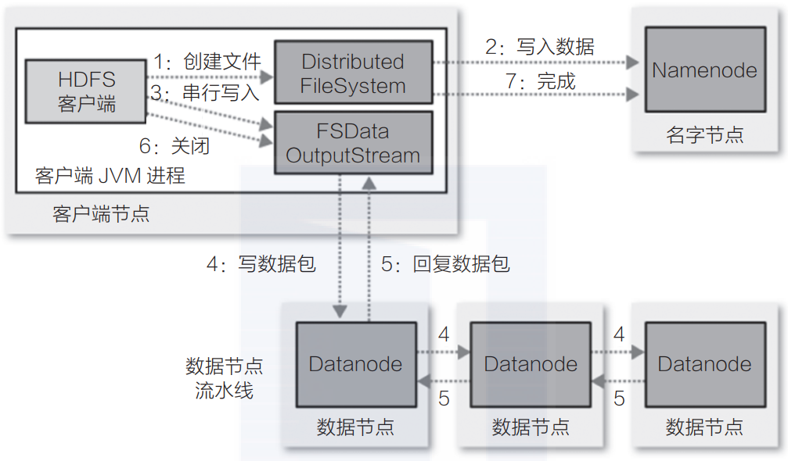
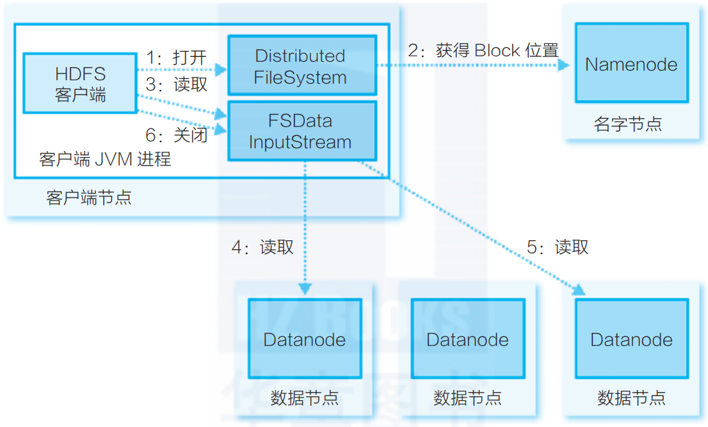

#HDFS知识点 
##1.架构组件：
(M/S架构)
**client**: 读写客户端，hdfs 命令  
**block**: 存储文件最小单元
**nameNode**: 保存整个文件系统的目录信息、文件信息及分块信息,保存block到dataNode的映射，保存文件到block的映射关系  
**secondaryNameNode**:   nameNode备份,协助处理fsImage,edits文件  
**dataNode**:数据保存节点

##2.写流程  

##3.读流程

客户端连接nameNode获取文件的块位置列表，客户端选择一台节点连接建立输入流，dataNode通过输入流写入chunk,封装成packet,客户端获取数据，并通过checkSum校验数据，如果block获取失败，则重新选择一台dataNode获取数据  
##4.高可用设计

ZKFC监控NN的健康状态，如果NN不健康，触发ZK重新选主，然后将standBy变成主，同时修改自身的状态为standBy;  
JN节点数据(通过Paxos共识算法实现共享存储)：
a）Active NameNode 会定期地把 修改命名空间或删除备份数据块等操作 记录到 EditLog，同时写到 JN 的 多数节点 中。
b）Standby NameNode 会一直监听 JN 上 EditLog 的变化，如果 EditLog 有改动，Standby NameNode 就会读取 EditLog 并与当前的命名空间合并。
c）Active NameNode 出现故障时，Standby NameNode 会保证已经从 JN 上读取了所有 EditLog 并与命名空间合并，然后才会从 Standby 切换为 Active。
dataNode:
DataNode 会同时向两个 NameNode 发送心跳以及数据块的存储信息。（无法感知切换，所有同时发，standby只是接受消息，并不处理）

##5.数据存储  
三副本，机架感知，pipeline，balance,分级存储，标签存储

##6.hdfs 联邦

